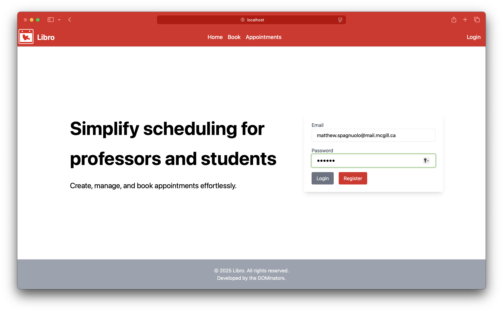
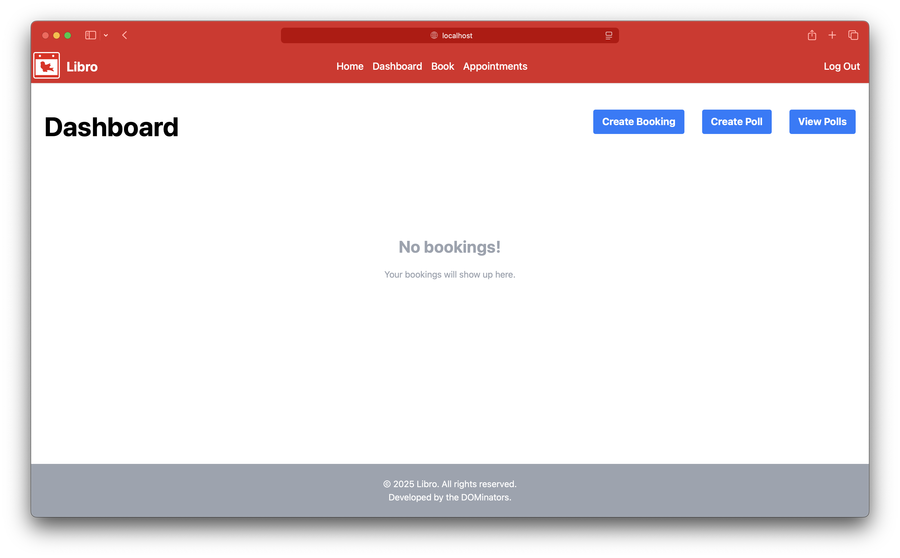
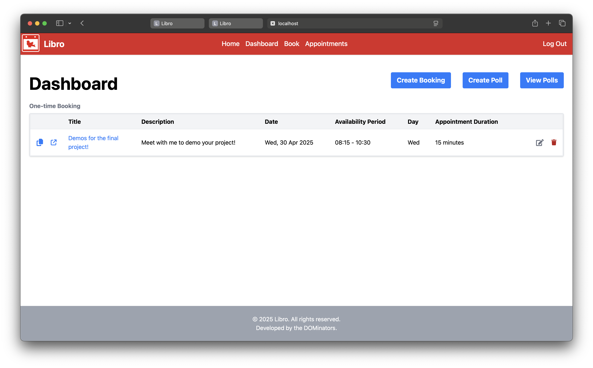
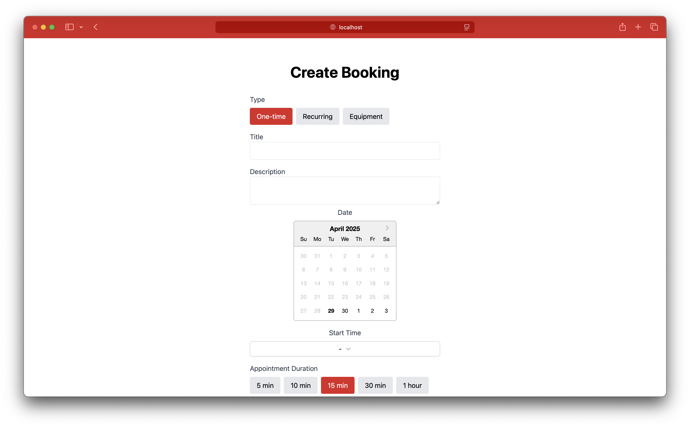
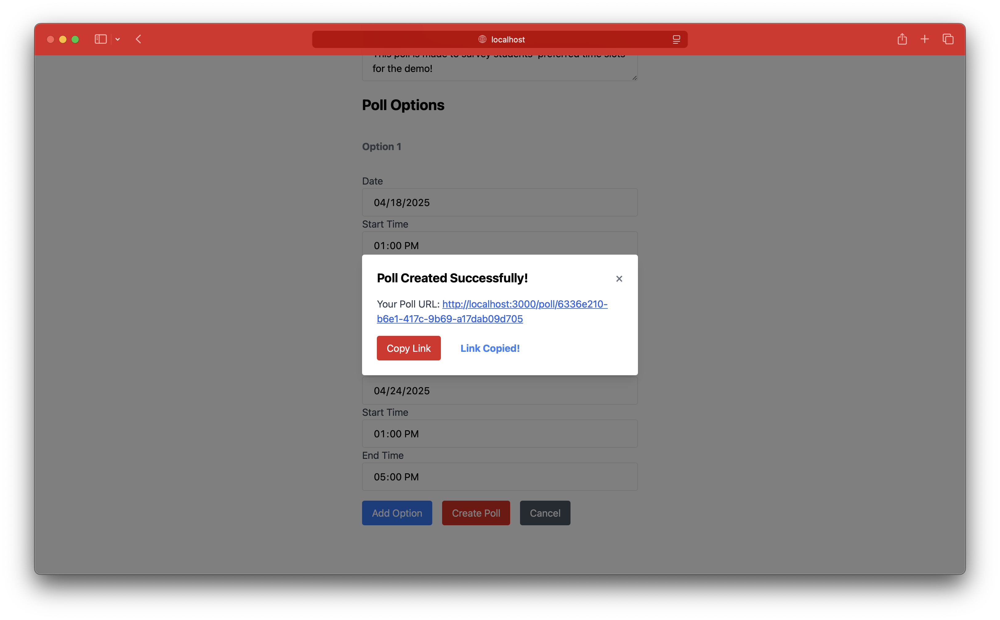
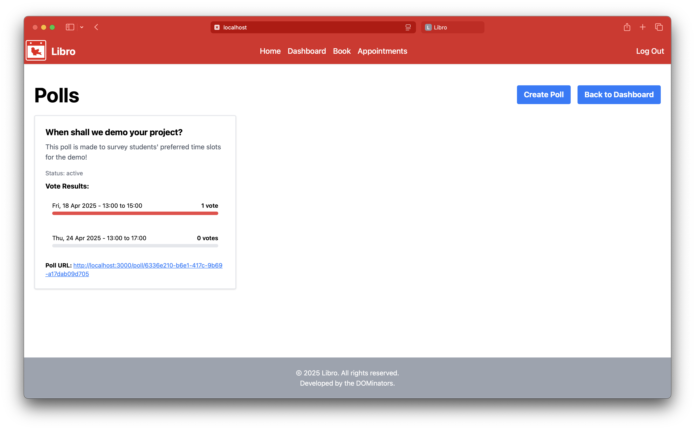
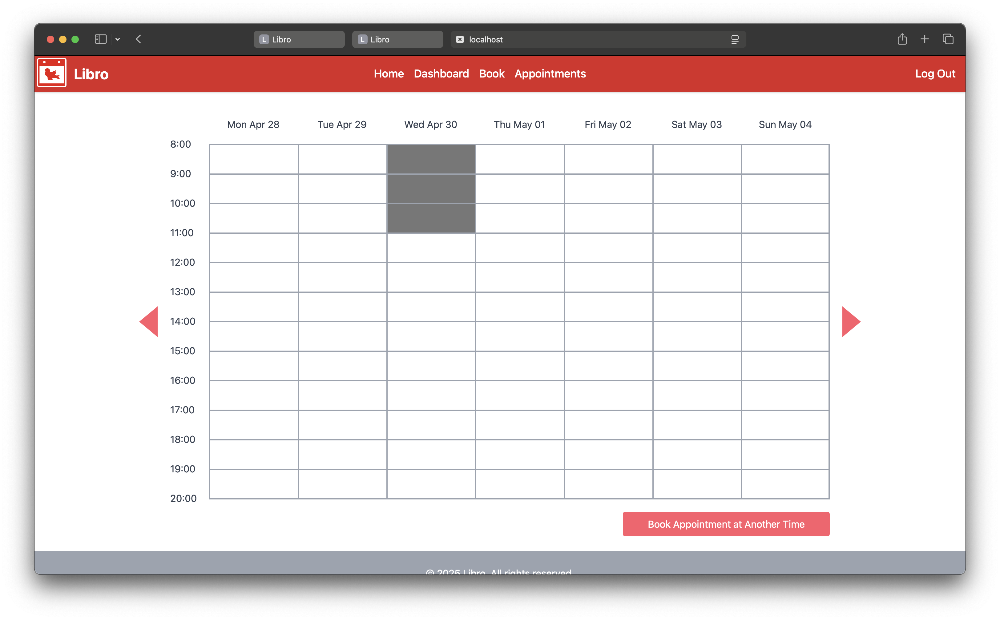
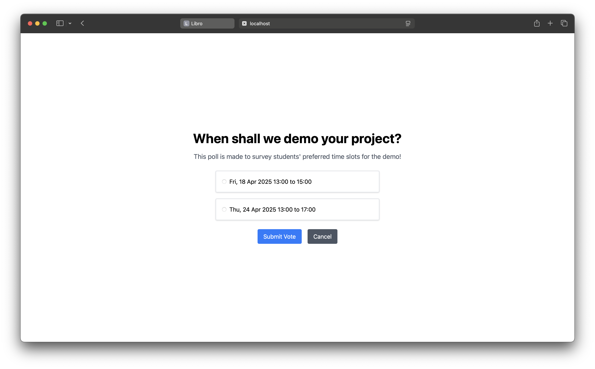

# Libro
## Simplify scheduling for professors and students
Create, manage, and book appointments effortlessly.

<p align="center">
  
  
  
  
  
  
  
  
</p>


# Usage instructions

Here are the instructions for running the application locally. Before running it, you should clone this repository, and ensure you have Node.js installed:

```bash
node -v
```

## Needed environment variables
```
JWT_SECRET=<your secret>
GMAIL_USER=<your gmail email>
GMAIL_PASSWORD=<your gmail password>
MONGO_URI=<your mongo uri>
```

## Running the client

To run the react application, open a new terminal and cd into `client` then run the following:

```bash
npm install
npm start
```

You should be able to see the react application in your browser at http://localhost:3000.

## Running the server

To run the server, open a new terminal and cd into `server` then run the following:

```bash
npm install
```

- For running the development server using `nodemon`, run:

  ```bash
  npm run dev
  ```


- For running the production server, run:

  ```bash
  npm start
  ```

## Note

This was a team effort. See README.txt for full credits.
